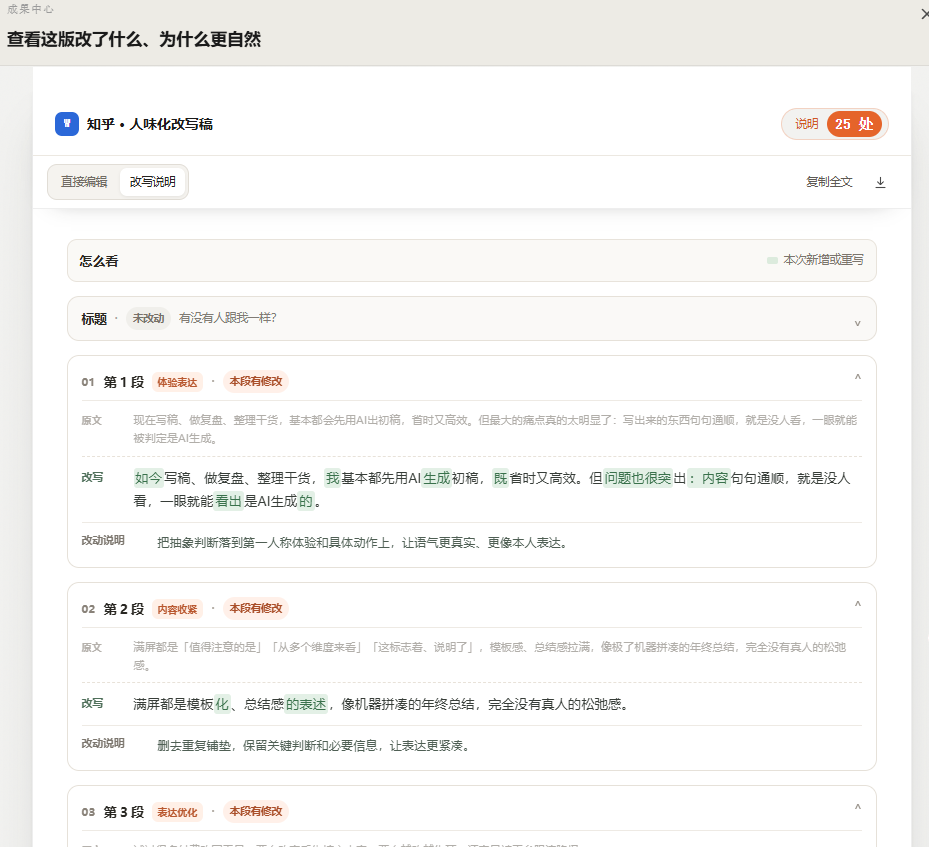

# 🔥12000 \+ 博主在用！怎么消除 ai 写作痕迹，AI 写稿去除 ai 痕迹防限流

ChatGPT 写完的稿子机器感很重，不少新媒体博主到处搜**怎么消除 ai 写作痕迹**，希望找到简单办法**去除 ai 痕迹**。反复人工修改耗时长，发布还容易踩平台规则遭遇限流。小橡皮 AI 专注**去 ai 味**、AI 痕迹检测，一站式解决 AI 写作机器味重、平台限流、规则信息差问题，支持免费去除 ai 痕迹等创作需求，适配新媒体全平台内容创作，已有 12000 \+ 专业创作者正在使用。

### 💥💥💥已服务 12000\+ 新媒体创作者、博主、运营从业者 

在线体验地址：[小橡皮](https://xiangpiai.cn/workspace?from=github0901jw)[https://xiangpiai\.cn/](https://xiangpiai.cn/workspace?from=github0901jw)

## 💡核心功能特性

### ✨一键变人味｜快速去除 ai 痕迹

无需复杂提示词调试，上传文档一键改写，把 AI 初稿加工为更贴近真人表达、可直接发布的文稿。

- 适配小红书 / 公众号 / 抖音 / 知乎不同平台文风，一套原稿适配多渠道分发

- 只优化语句表达，完整保留原文核心观点，不篡改创作本意

- 改写完成自动质检，统计优化项，全部修改点可视化展示，附带改写说明

- 支持在线二次编辑，可复制文本、导出 Word 文档，有效淡化 AI 痕迹。

### 🛡️防限流｜发布前风控扫描

解决平台规则不透明、人工排查效率低、违规提示模糊等创作者痛点。

- 适配抖音、小红书、公众号、头条多平台规则，扫描识别违禁词、导流、夸大宣传等风险

- 红 / 橙 / 蓝三色标记风险等级，直观标注问题位置

- 给出违规原因与上下文适配替换建议，支持一键替换、手动修改或者直接忽略

- 词库跟随平台政策实时更新，提前规避隐形降权风险，保护账号权重，提升多平台分发效率。

### 📢平台信息差｜平台新规解读

解决平台公告分散、官方条文晦涩，面对新规不知道是否需要调整稿件的困境。

- 每日聚合主流平台官方新规，支持跳转查看原文，信息来源可靠

- 通俗拆解新规内容：明确受影响创作者群体、常见踩坑点，输出可落地的创作调整建议

- 评估存量 / 待发稿件受影响程度，给出「积极调整 / 保持观察」行动参考

- 快速掌握平台动向，避免盲目删改稿件，保障账号稳定更新节奏。

## 📑全场景适配支持

**新媒体创作场景** 小红书种草文案、公众号推文、抖音口播稿、知乎干货文、短视频文案、团队复盘稿、营销推广文案，帮助消除 ai 写作痕迹、弱化去 ai 味，适配各平台流量推荐机制。

**AI 辅助创作优化场景** 适配 ChatGPT 等 AI 工具生成初稿优化，改善 AI 内容模板化、机器感重、无法直接发布的问题，通过 ai 去痕处理，让 AI 初稿更贴近真人产出风格。

**账号合规运营场景** 多平台内容批量合规自查、存量笔记风险排查、新稿发布前风控检测，降低限流降权、账号处罚概率，维护账号稳定流量与权重。

**通用内容运营场景** 实时跟进小红书、公众号、知乎等平台内容新规动态，解读规则信息差，帮助创作者及时了解平台变化，助力账号长久稳定运营。

## 🎯谁在用小橡皮 AI

**个人用户**

- 小红书、抖音、公众号、知乎全职 / 兼职内容博主、创作者

- 依赖 ChatGPT 生成文案，想要去除 ai 痕迹、改善 AI 写作痕迹的创作人群

- 新媒体运营、营销文案从业者、短视频内容创作者

- 需要免费检测 AI 痕迹、低成本优化内容真人质感的个人用户

**机构用户**

- MCN 机构、自媒体运营工作室、内容营销公司

- 新媒体代运营团队、短视频创作服务商

- 内容创作社群、校园创作渠道、独立运营服务商

## 💥💥💥用户使用反馈

